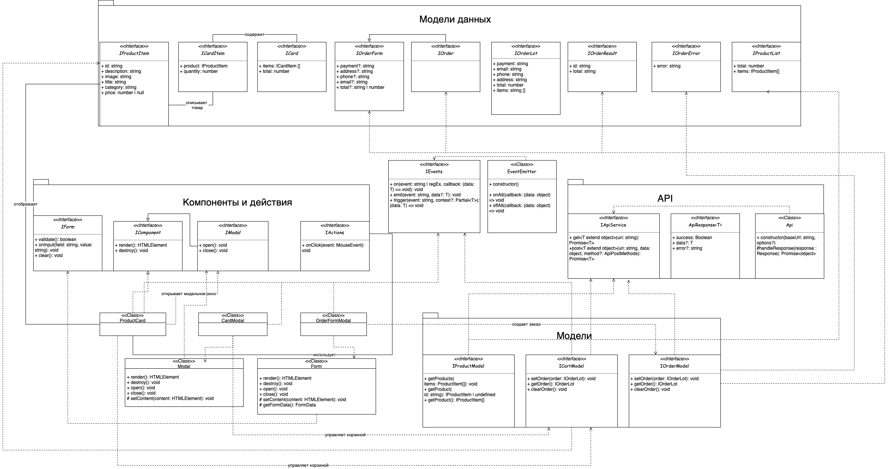
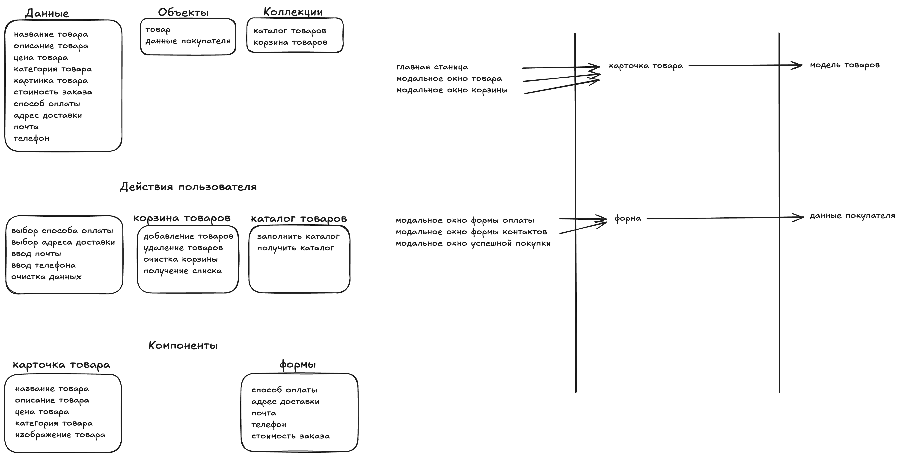

# Проектная работа "Веб-ларек"

Стек: HTML, SCSS, TS, Webpack

Структура проекта:
- src/ — исходные файлы проекта
- src/components/ — папка с JS компонентами
- src/components/base/ — папка с базовым кодом
- src/types/ — типы данных
- src/utils/ — утилиты
- src/scss/ — стили

Важные файлы:
- src/pages/index.html — HTML-файл главной страницы
- src/types/index.ts — файл с типами
- src/index.ts — точка входа приложения
- src/scss/styles.scss — корневой файл стилей
- src/utils/constants.ts — файл с константами
- src/utils/utils.ts — файл с утилитами

## Об архитектуре

Взаимодействия внутри приложения происходят через события. Модели инициализируют события, слушатели событий в основном коде выполняют передачу данных компонентам отображения, а также вычислениями между этой передачей, и еще они меняют значения в моделях.
Серверные запросы выполняются централизованным сервисом `ApiService`, который затем передает данные моделям для их хранения и обработки.

## Архитектура проекта

Архитектура проекта основана на MVP-паттерне с использованием брокера событий для взаимодействия между частями приложения. Основные части архитектуры включают Модели данных (только для хранения и управления данными), Представления (Компоненты), Связующий слой (логика приложения, управляемая событиями) и Сервис API (для взаимодействия с сервером).

### Основные компоненты и их назначение

1.  **Модели данных**: Отвечают за хранение и управление состоянием данных приложения, а также бизнес-логику, не связанную с сетевыми запросами.
2.  **Представления (Компоненты)**: Отвечают за отображение данных пользователю и обработку его действий. Включают базовые классы `Modal` и `Form` для переиспользования логики.
3.  **Брокер событий**: Обеспечивает слабую связанность между компонентами, позволяя им взаимодействовать путем подписки на события и их публикации. Реализован классом `EventEmitter`.
4.  **Сервис API**: Отвечает за взаимодействие с внешним API для получения и отправки данных. Реализован классом `Api`.

### Взаимодействие компонентов

Взаимодействие происходит преимущественно через брокер событий (`IEvents` и его реализация `EventEmitter`). Модели данных (`IProductModel`, `ICartModel`, `IOrderModel`) могут инициировать события при изменении своего состояния (например, 'cart:updated'). Компоненты (`ProductCard`, `CartModal`, `OrderFormModal`, которые будут наследоваться от базовых `Modal` и `Form`) могут подписываться на эти события, чтобы обновить свое отображение. Компоненты также могут вызывать методы моделей напрямую для выполнения действий (например, добавить товар в корзину). Сервис API (`IApiService` и его реализация `Api`) используется для всех запросов к серверу, а полученные данные передаются в модели.

Процессы в приложении (например, добавление товара в корзину, оформление заказа) реализуются путем вызова соответствующих методов моделей или взаимодействия с компонентами через брокер событий. Запросы на сервер всегда выполняются через `ApiService`.

### Данные, используемые в приложении и их описание

Проект работает со следующими основными типами данных, определенными в `src/types/index.ts`:

*   `IProductItem`: Интерфейс, описывающий структуру данных одного товара, получаемых или используемых в приложении.
    *   `id: string`: Уникальный идентификатор товара.
    *   `description: string`: Подробное описание товара.
    *   `image: string`: URL изображения товара.
    *   `title: string`: Название товара.
    *   `category: string`: Категория товара.
    *   `price: number | null`: Цена товара. Может быть `null`, если товар недоступен для покупки.

*   `ApiListResponse<Type>`: Тип, описывающий стандартный ответ API при запросе списка ресурсов.
    *   `total: number`: Общее количество элементов.
    *   `items: Type[]`: Массив элементов указанного типа.

*   `ApiPostMethods`: Тип, определяющий разрешенные HTTP-методы для POST-запросов (`'POST'`, `'PUT'`, `'DELETE'`).

*   `ICartItem`: Интерфейс, описывающий отдельный элемент в корзине.
    *   `product: IProductItem`: Сам товар.
    *   `quantity: number`: Количество данного товара в корзине.

*   `ICart`: Интерфейс, описывающий состояние корзины.
    *   `items: ICartItem[]`: Массив элементов корзины.
    *   `total: number`: Общая стоимость товаров в корзине.

*   `IOrderForm`: Интерфейс, описывающий данные формы заказа на первом и втором шагах оформления.
    *   `payment?: string`: Выбранный способ оплаты (опционально до выбора).
    *   `address?: string`: Адрес доставки (опционально до ввода).
    *   `phone?: string`: Телефон покупателя (опционально до ввода).
    *   `email?: string`: Email покупателя (опционально до ввода).
    *   `total?: string | number`: Общая стоимость заказа (опционально, может быть строкой или числом).

*   `IOrder`: Интерфейс, описывающий структуру заказа после его создания (наследует от `IOrderForm`).
    *   Наследует все свойства от `IOrderForm`.
    *   `items: string[]`: Массив идентификаторов товаров в заказе.

*   `IOrderLot`: Интерфейс, описывающий полные данные заказа для отправки на сервер.
    *   `payment: string`: Выбранный способ оплаты.
    *   `email: string`: Email покупателя.
    *   `phone: string`: Телефон покупателя.
    *   `address: string`: Адрес доставки.
    *   `total: number`: Общая стоимость заказа.
    *   `items: string[]`: Массив идентификаторов товаров в заказе.

*   `IOrderResult`: Интерфейс, описывающий структуру ответа сервера после успешного создания заказа.
    *   `id: string`: Идентификатор созданного заказа.
    *   `total: number`: Подтвержденная сервером общая стоимость заказа.

*   `IOrderError`: Интерфейс, описывающий структуру ответа сервера при ошибке создания заказа.
    *   `error: string`: Сообщение об ошибке.

### Описание основных интерфейсов и классов

*   `<<class>> Api`: Класс для выполнения HTTP-запросов к API сервера.
    *   **Назначение:** Предоставляет методы для GET, POST, PUT, DELETE запросов, а также обработку ответов. Является основной точкой взаимодействия с внешним API.
    *   **Конструктор:**
        *   `constructor(baseUrl: string, options?: RequestInit)`: Принимает базовый URL для API и необязательный объект `options` для настроек Fetch API (например, заголовки).
    *   **Методы:**
        *   `get<T extends object>(uri: string): Promise<T>`: Выполняет GET-запрос к указанному URI.
        *   `post<T extends object>(uri: string, data: object, method?: ApiPostMethods): Promise<T>`: Выполняет POST-запрос с указанным URI и телом данных, опционально с указанием метода HTTP (`POST`, `PUT`, `DELETE`).
    *   **Защищенные методы:**
        *   `protected handleResponse(response: Response): Promise<object>`: Обрабатывает ответ от сервера, преобразуя его в JSON или отклоняя Promise в случае ошибки.

*   `<<class>> EventEmitter implements IEvents`: Брокер событий, реализующий паттерн наблюдатель.
    *   **Назначение:** Обеспечивает механизм публикации-подписки для обмена сообщениями (событиями) между слабосвязанными частями приложения. Позволяет компонентам и моделям взаимодействовать, не зная друг о друге напрямую.
    *   **Конструктор:**
        *   `constructor()`: Не принимает аргументов. Инициализирует внутреннее хранилище для обработчиков событий.
    *   **Методы:**
        *   `on<T extends object>(eventName: string | RegExp, callback: (data: T) => void): void`: Подписывает обработчик `callback` на событие с именем `eventName` (строка или регулярное выражение). `callback` будет вызван при возникновении события.
        *   `off(eventName: string, callback: Function): void`: Отписывает обработчик `callback` от события `eventName`.
        *   `emit<T extends object>(eventName: string, data?: T): void`: Публикует событие с именем `eventName`, передавая опциональные данные `data` всем подписанным обработчикам.
        *   `onAll(callback: (event: { eventName: string, data: unknown }) => void): void`: Подписывает обработчик на все события.
        *   `offAll(): void`: Удаляет все обработчики со всех событий.
        *   `trigger<T extends object>(event: string, context?: Partial<T>): (data: T) => void`: Возвращает функцию, которая при вызове инициирует событие `eventName` с переданными данными и опциональным контекстом.

*   `<<interface>> IComponent`: Базовый интерфейс для всех визуальных компонентов приложения.
    *   **Назначение:** Определяет базовый контракт для элементов пользовательского интерфейса, которые могут быть отображены.
    *   **Методы:**
        *   `render(): HTMLElement`: Метод для создания или обновления DOM-элемента компонента. Возвращает корневой HTMLElement компонента.

*   `<<class>> Modal implements IModal`: Базовый класс для всех модальных окон.
    *   **Назначение:** Предоставляет общую функциональность для модальных окон, такую как открытие, закрытие, управление оверлеем и прослушивание событий закрытия.
    *   **Конструктор:**
        *   `constructor(container: HTMLElement)`: Принимает корневой DOM-элемент, в который будет встраиваться модальное окно.
    *   **Методы:**
        *   `open(): void`: Открывает модальное окно.
        *   `close(): void`: Закрывает модальное окно.
    *   Реализует интерфейс `IModal`.

*   `<<class>> Form implements IForm`: Базовый класс для всех форм.
    *   **Назначение:** Предоставляет общую функциональность для форм, такую как валидация полей, обработка ввода и сброс формы.
    *   **Конструктор:**
        *   `constructor(container: HTMLElement)`: Принимает корневой DOM-элемент формы.
    *   **Методы:**
        *   `validate(): boolean`: Проверяет валидность всех полей формы. Возвращает `true`, если форма валидна, иначе `false`.
        *   `onInput(field: string, value: string): void`: Обрабатывает ввод данных в поле формы.
        *   `clear(): void`: Очищает все поля формы.
    *   Реализует интерфейс `IForm`.

*   `<<interface>> IActions`: Интерфейс для определения действий, которые могут быть привязаны к элементам пользовательского интерфейса.
    *   **Назначение:** Позволяет типизировать обработчики событий, чаще всего кликов, передаваемых компонентам.
    *   **Методы:**
        *   `onClick(callback: (event: MouseEvent) => void): void`: Метод-обработчик события клика мышью, который принимает колбэк.

*   `<<interface>> IEvents`: Интерфейс брокера событий, используемый классом `EventEmitter`.
    *   **Назначение:** Определяет контракт для механизма публикации-подписки.
    *   **Методы:**
        *   `on<T extends object>(event: string | RegExp, callback: (data: T) => void): void`: Подписывает обработчик на событие.
        *   `emit<T extends object>(event: string, data?: T): void`: Публикует событие с данными.
        *   `trigger<T extends object>(event: string, context?: Partial<T>): (data: T) => void`: Возвращает функцию-триггер события.

*   `<<interface>> IApiService`: Интерфейс сервиса для взаимодействия с API сервера.
    *   **Назначение:** Предоставляет стандартизированные методы для выполнения HTTP-запросов к внешнему API. Этот интерфейс используется моделями, когда им нужны данные с сервера.
    *   **Методы:**
        *   `get<T extends object>(uri: string): Promise<T>`: Выполняет GET-запрос.
        *   `post<T extends object>(uri: string, data: object, method?: ApiPostMethods): Promise<T>`: Выполняет POST-запрос с указанным методом и данными.

*   `<<interface>> IProductModel`: Интерфейс модели данных для работы с товарами.
    *   **Назначение:** Отвечает за хранение и управление состоянием данных о товарах. **Не выполняет прямых запросов к API.** Получает данные от `IApiService`.
    *   **Методы:**
        *   `setProducts(items: IProductItem[]): void`: Устанавливает список товаров.
        *   `getProduct(id: string): IProductItem | undefined`: Возвращает данные конкретного товара по его `id`.
        *   `getProducts(): IProductItem[]`: Возвращает текущий список всех товаров.

*   `<<interface>> ICartModel`: Интерфейс модели данных для работы с корзиной.
    *   **Назначение:** Управляет состоянием корзины: добавлением, удалением товаров, расчетом общей стоимости. **Не выполняет прямых запросов к API.**
    *   **Методы:**
        *   `addItem(product: IProductItem): void`: Добавляет указанный `product` в корзину.
        *   `removeItem(productId: string): void`: Удаляет товар с указанным `productId` из корзины.
        *   `getItems(): ICartItem[]`: Возвращает текущий список элементов в корзине.
        *   `getTotal(): number`: Возвращает общую стоимость товаров в корзине.
        *   `clear(): void`: Полностью очищает корзину.

*   `<<interface>> IOrderModel`: Интерфейс модели данных для работы с заказами.
    *   **Назначение:** Отвечает за хранение и управление данными заказа. **Не выполняет прямых запросов к API.**
    *   **Методы:**
        *   `setOrder(order: IOrderLot): void`: Устанавливает данные заказа.
        *   `getOrder(): IOrderLot`: Возвращает текущие данные заказа.
        *   `clearOrder(): void`: Очищает данные заказа.

### Описание классов компонентов (Представления)

*   `ProductCard`: Класс, представляющий визуальный компонент карточки товара.
    *   **Назначение:** Отображает информацию о товаре (название, цена, категория, изображение) и предоставляет функционал для взаимодействия (клик для просмотра деталей, кнопка добавления в корзину).
    *   **Конструктор:**
        *   `constructor(container: HTMLElement, actions?: IActions)`: Принимает корневой DOM-элемент для компонента и опциональный объект с действиями типа `IActions` для обработки кликов.
    *   **Свойства:** Может иметь свойства для ссылок на DOM-элементы внутри карточки (`_titleElement`, `_priceElement` и т.п.) и ссылку на объект данных товара (`_productData`).
    *   **Методы/Сеттеры:** Могут включать методы для обновления отображения карточки (`set productData(data: IProductItem)`), привязки обработчиков событий.
    *   Реализует интерфейс `IComponent`.

*   `CartModal extends Modal`: Класс, представляющий визуальный компонент модального окна корзины.
    *   **Назначение:** Отображает список товаров в корзине, их количество и общую стоимость. Предоставляет функционал для изменения количества, удаления товаров и перехода к оформлению заказа. Наследует общую логику модального окна от базового класса `Modal`.
    *   **Конструктор:**
        *   `constructor(container: HTMLElement, events: IEvents)`: Принимает корневой DOM-элемент модального окна и экземпляр брокера событий `IEvents`.
    *   **Свойства:** Может иметь свойства для ссылок на DOM-элементы списка товаров, общей стоимости, кнопки оформления.
    *   **Методы/Сеттеры:** Методы для обновления списка товаров (`set items(data: ICartItem[])`), обновления общей стоимости (`set total(value: number)`). Наследует методы `open()` и `close()` от базового класса `Modal`.

*   `OrderFormModal extends Modal`: Класс, представляющий визуальный компонент модального окна с формами оформления заказа.
    *   **Назначение:** Отображает шаги оформления заказа (выбор оплаты/адреса, ввод контактов), собирает данные от пользователя, выполняет валидацию и инициирует процесс создания заказа. Наследует общую логику модального окна от базового класса `Modal` и использует логику базового класса `Form` для управления полями ввода и валидацией.
    *   **Конструктор:**
        *   `constructor(container: HTMLElement, events: IEvents)`: Принимает корневой DOM-элемент модального окна и экземпляр брокера событий `IEvents`.
    *   **Свойства:** Может иметь свойства для ссылок на DOM-элементы полей ввода, кнопок, сообщений об ошибках.
    *   **Методы/Сеттеры:** Методы для отображения текущего шага (`showStep(step: number)`), сбора данных формы (`get formData(): IOrderForm`), отображения ошибок (`showErrors(errors: string[])`). Наследует методы `open()` и `close()` от `Modal`. Методы валидации и управления вводом делегируются внутренней реализации форм.

## UML Диаграмма Архитектуры



## Исходная схема-набросок



## Установка и запуск
Для установки и запуска проекта необходимо выполнить команды

```
npm install
npm run dev
```

или

```
yarn
yarn dev
```

## Сборка

```
npm run build
```

или

```
yarn build
```
